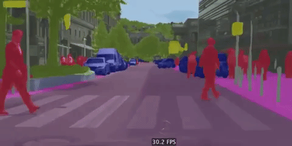
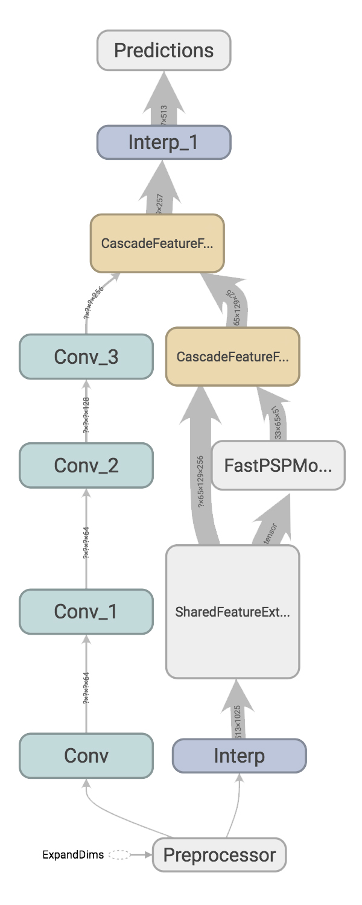

## Real-Time Semantic Segmentation in [TensorFlow](https://github.com/tensorflow/tensorflow)

Perform pixel-wise semantic segmentation on high-resolution images in real-time with Image Cascade Network (ICNet), the highly optimized version of the state-of-the-art Pyramid Scene Parsing Network (PSPNet). **This project implements ICNet and PSPNet50 in Tensorflow trained on Cityscapes.**

<p align = 'center'>

</p>

<p align = 'center'>
Deploy ICNet and preform inference at over 30fps on Titan X.
</p>

This implementation is based off of the original ICNet paper proposed by Hengshuang Zhao titled [ICNet for Real-Time Semantic Segmentation on High-Resolution Images](https://arxiv.org/abs/1704.08545). Some ideas were also taken from their previous PSPNet paper, [Pyramid Scene Parsing Network](https://arxiv.org/abs/1612.01105
). The Network Compression implemented is based on the paper [Pruning Filters for Efficient ConvNets](https://arxiv.org/abs/1608.08710
).

Various modifications had to be made to the original architecture in order to reproduce the training process. More can be read about this <a href='docs/models.md'>here</a>.

### Release information

#### September 22, 2018
The baseline PSPNet50 pre-trained model files have been released publically in the Model Zoo. The accuracy of the model surpases that referenced in the ICNet paper.

#### August 12, 2018
Initial release. Project includes scripts for training ICNet, evaluating ICNet and compressing ICNet from ResNet50 weights. Also includes scripts for training PSPNet and evaluating PSPNet as a baseline. Working on achieving the author's reported accuracy. Will update with links to pre-trained cityscapes checkpoints once the accuracy is matched.

## Overview

<p align = 'center'>

</p>

<center>
*ICNet model in Tensorboard.*
</center>

### Training ICNet from ImageNet Weights

This project has implemented the ICNet training process, allowing you to train your own model directly from *ResNet50* weights as is done in the original work. Other implementations available simply convert the Caffe model to Tensorflow, only allowing for fine-tuning from weights trained on Cityscapes.

By training ICNet on weights initialized from ImageNet, you have more flexibility in the transfer learning process. Read more about setting up this process can be found <a href='docs/configs.md'>here</a>.

### ICNet Network Compression

In order to achieve real-time speeds, ICNet uses a form of network compression called filter pruning. This drastically reduces the complexity of the model by removing filters from convolutional layers in the network. This project has also implemented this ICNet compression process directly in Tensorflow.

The compression is working, however which "compression scheme" to use is still somewhat ambiguous when reading the original ICNet paper. This is still a work in progress. Read more about compression <a href='docs/compression.md'>here</a>.

### PSPNet Baseline Implementation

In order to also reproduce the baselines used in the original ICNet paper, you will also find implementations and pre-trained models for PSPNet50. Since ICNet can be thought of as a modified PSPNet, it can be useful for comparison purposes.

Informtion on training or using the baseline PSPNet50 model can be found <a href='docs/pspnet.md'>here</a>.

## Documentation

  * <a href='docs/installation.md'>Installation: Getting the project running on your machine</a><br>
  * <a href="docs/datasets.md">Datasets: Setting up a TFRecord file for training and evaluation</a><br>
  * <a href="docs/configs.md">Configs and Fine-tune Training: Setting up your own configuration files for training and evaluation</a><br>
  * <a href="docs/pspnet.md">PSPNet50: Training a PSPNet50 Walkthrough</a><br>
  * <a href="docs/model_zoo.md">Model Zoo: Some information about the models in this project and links to checkpoints</a><br>

## Quick Start

### Installation

This project uses Tensorflow. Make sure you have the latest version (at least v1.8), then clone the project and compile the protobuf files

```
git clone https://github.com/oandrienko/fast-semantic-segmentation
cd fast-semantic-segmentation
make build-protos
```

Next, you will need to <a href="docs/datasets.md">format your dataset</a> into a TFRecord file and <a href="docs/configs.md">modify the sample configs</a> provided in the project.

### Training and Evaluation

Use `train.py` to train a fast semantic segmentation network. If you wish to use a large batch-size and are willing to wait longer for training, use `train_mem_saving.py` which uses memory saving gradients from OpenAI.

Example usage for training ICNet:

```
python train.py \
	--config_path configs/my_sample_icnet_resnet_v1.config \
	--logdir path/to/train/dir  \
	--image_summaries
```

Example usage for evaluation with ICNet:

```
python eval.py \
	--train_dir path/to/train/dir \
	--eval_dir path/to/eval/dir \
	--config_path configs/my_sample_icnet_resnet_v1.config \
	--image_summaries
```

## Maintainers
* Oles Andrienko, github: [oandrienko](https://github.com/oandrienko)

## Related Work

This project and it's documentation was highly based on the *Tensorflow Object Detection API*. It was the initial inspiration for this project. The `third_party` directory of this project contains files from *OpenAI's Gradient Checkpointing* project by Tim Salimans and Yaroslav Bulatov. The helper modules found in `third_party/model_deploy.py` are from the Tensorflow Slim project. Finally, I used another open source ICNet implementation which converts the original ICNet weights as a reference implementation. Find all these projects below:

* [Tensorflow Object Detection API](https://github.com/tensorflow/models/tree/master/research/object_detection)
* [Saving memory using gradient-checkpointing](https://github.com/openai/gradient-checkpointing)
* [Tensorflow Slim](https://github.com/tensorflow/models/tree/master/research/slim)
* [ICNet converted from Caffe using Caffe-Tensorflow](https://github.com/hellochick/ICNet-tensorflow)

## Thanks

* This project could not have happened without the advice (and GPU access) given by Professor Steven Waslander and Ali Harakeh from the Waterloo Autonomous Vehicles Lab.
